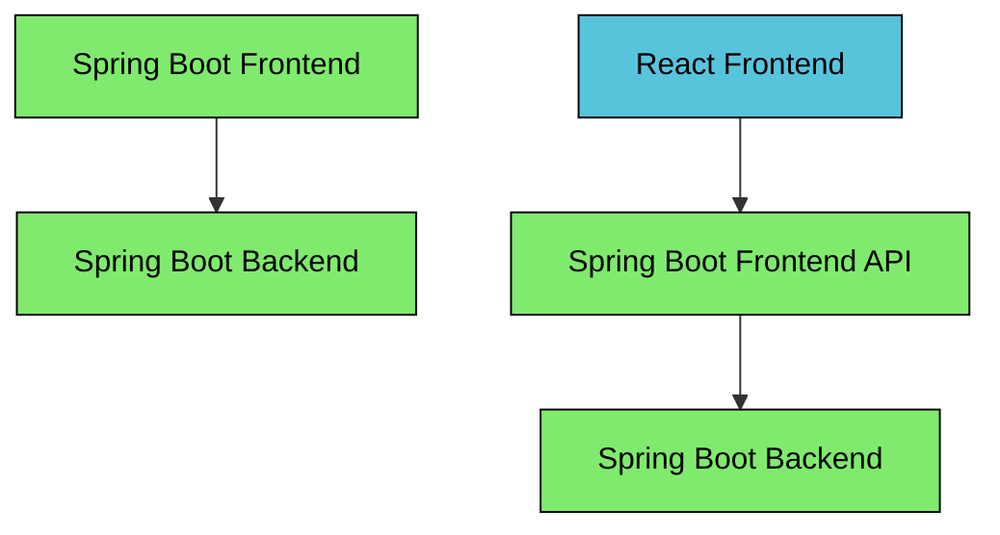

# Spring Boot Sandbox
This repository contain sandbox projects to showcase features of the Spring Boot framework.

## Use case
Most examples implement a "hello world" style logic that returns a greeting message when the user inputs a name.

* A user inputs the name "John" and clicks "Submit"
* The system generates a greeting "Hello John!" back to the user

The examples typically consists of a `Frontend` and a `Backend` application. If the frontend is a JavaScript
application then there is often a `Frontend API` application.

## Examples
Read details about the examples in their respective project roots.

* [OAuth2 Token Relay](./spring-boot-oauth2-token-relay)
* [OAuth2 Token Exchange](./spring-boot-oauth2-token-exchange)
* [OAuth2 Extended Authorization Server](./spring-boot-oauth2-extended-authorization-server)
* [CDC Event Streaming](./spring-boot-cdc-event-streaming)
