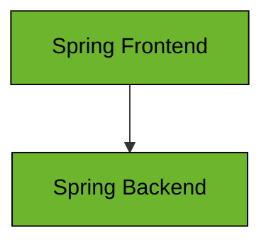
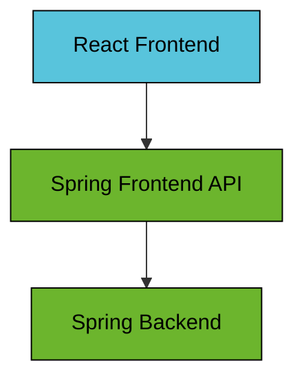

# Spring Boot Sandbox

This repository contain sandbox projects to showcase features of the
[Spring Boot framework](https://spring.io/projects/spring-boot).

All examples are written in [Kotlin](https://kotlinlang.org) and built using [Gradle](https://gradle.org).

## Examples
Read details about the examples in their respective project roots.

* [REST API](./apps/spring-boot-rest-api)
* [OAuth2 Token Relay](./apps/spring-boot-oauth2-token-relay)
* [OAuth2 Token Exchange](./apps/spring-boot-oauth2-token-exchange)
* [OAuth2 Extended Authorization Server](./apps/spring-boot-oauth2-extended-authorization-server)
* [CQRS Kafka](./apps/spring-boot-cqrs-kafka)
* [CDC Kafka](./apps/spring-boot-cdc-kafka)
* [OTEL Observability](./apps/spring-boot-otel-observability)

## Architecture
Spring Boot is a framework for building applications for the
[JVM runtime](https://en.wikipedia.org/wiki/Java_virtual_machine). Spring Boot was created to make it easier
to build and configure application based on the [Spring framework](https://spring.io/projects/spring-framework).
It is an opinionated framework that has a focus on convention over configuration. At it's core is the
[Spring IoC-container](https://docs.spring.io/spring-framework/reference/core/beans.html) which enables the
use of [Dependency Injection](https://docs.spring.io/spring-framework/reference/core/beans/dependencies/factory-collaborators.html)
and [Aspect Oriented Programming](https://docs.spring.io/spring-framework/reference/core/aop.html).

The examples typically consists of a `Frontend` and a `Backend` application.

If the frontend is a JavaScript application then there is often a `Frontend API` application.

## Use case
Most examples implement a *"hello world"* style logic that returns a greeting message when the user inputs a name.

* A user inputs the name "John" and clicks "Submit"
* The system generates a greeting "Hello John!" back to the user
