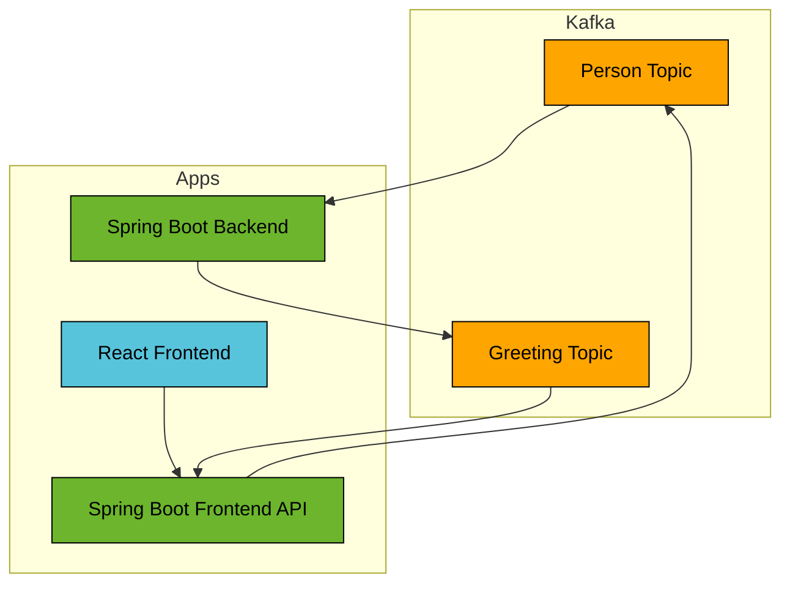

# Spring Boot Kafka CQRS

This example shows a CQRS architecture using Ktor applications and messaging using Apache Kafka.

## Prerequisites

* Java Runtime - e.g. [Temurin JDK](https://adoptium.net) or [OpenJDK](https://openjdk.org)
* [NodeJS Runtime](https://nodejs.org)
* [NPM](https://www.npmjs.com) or [Yarn](https://yarnpkg.com)
* [Docker](https://www.docker.com)

## Run

Start Kafka Docker container:
```bash
docker compose -f ../docker/kafka/docker-compose.yml up -d
```

Start Backend application:
```bash
../gradlew :spring-boot-kafka-cqrs:backend:bootRun
```

Start Frontend API application:

```bash
../gradlew :spring-boot-kafka-cqrs:frontend-api:bootRun
```

Start Frontend application (this should open a browser window):
```bash
yarn --cwd ./frontend install
yarn --cwd ./frontend start
```

## Architecture


