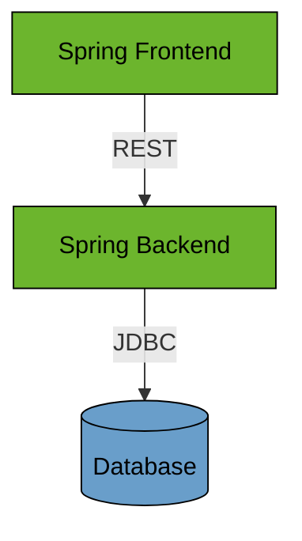

# Spring Boot CRUD JPA

This example shows a Spring Boot CRUD app using Thymeleaf and JPA.

## Prerequisites

* Java Runtime - e.g. [Temurin JDK](https://adoptium.net) or [OpenJDK](https://openjdk.org)

## Run

Start Backend application:
```bash
../gradlew :spring-boot-crud-jpa:backend:bootRun
```

Start Frontend application:

```bash
../gradlew :spring-boot-crud-jpa:frontend:bootRun
```

## Architecture



### Backend

The Backend is a REST API application based on Spring Boot with .

### Frontend

The Frontend is a web application based on Spring Boot and Thymeleaf.
