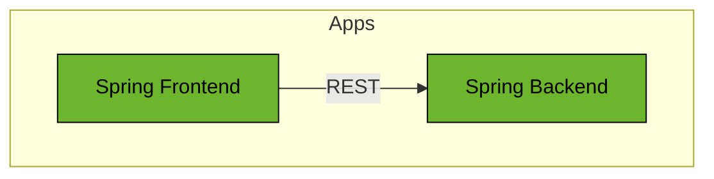

# Spring Boot Form Login

This example shows how to secure a React frontend and Spring Boot REST API using form login and Basic Authentication.

## Prerequisites

* Java Runtime - e.g. [Temurin JDK](https://adoptium.net) or [OpenJDK](https://openjdk.org)
* [NodeJS Runtime](https://nodejs.org)

## Run

Start Backend application:
```bash
../../gradlew :apps:spring-boot-form-login:backend:bootRun
```

Start Frontend API application:

```bash
../../gradlew :apps:spring-boot-form-login:frontend:bootRun
```

## Architecture



### Backend

The Backend is a REST API application based on Spring Boot and with an OAuth2 Resource Server security configuration.

This Spring Boot application is protected by Spring Security using the OAuth2 Authorization Code Grant login flow.

Look at the `WebSecurityConfig` class and the `application.yml` files for more details on the security configuration.

### Frontend

The Frontend is a web application based on Spring Boot and Thymeleaf.
