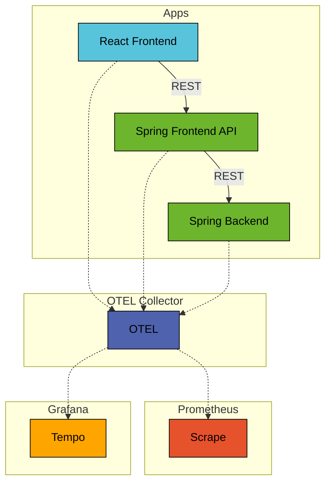

# Spring Boot OTEL Observability

This example shows an observability enabled architecture with Open Telemetry and Micrometer.

## Prerequisites

* Java Runtime - e.g. [Temurin JDK](https://adoptium.net) or [OpenJDK](https://openjdk.org)
* [NodeJS Runtime](https://nodejs.org)
* [NPM](https://www.npmjs.com) or [Yarn](https://yarnpkg.com)
* [Docker](https://www.docker.com)

## Run

Start Kafka Docker container:
```bash
docker compose -f ../../docker/kafka/docker-compose.yml up -d
```

Start Backend application:
```bash
../../gradlew :apps:spring-boot-otel-observability:backend:bootRun
```

Start Frontend API application:

```bash
../../gradlew :apps:spring-boot-otel-observability:frontend-api:bootRun
```

Start Frontend application (this should open a browser window):
```bash
yarn --cwd ./frontend install
yarn --cwd ./frontend start
```

## Architecture



### Frontend

The Frontend is a JavaScript web application based on ReactJS and using the React Bootstrap framework.

### Frontend API

The Frontend API is a REST API application based on Spring Boot.

### Backend

The Backend is a REST API application based on Spring Boot.
