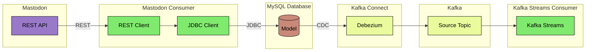

# CDC Event Streaming

This example implements a Change Data Capture (CDC) pipeline with Apache Kafka.

CDC is often used to publish records of data changes in a database.

## Architecture



The arrows in the diagram above signify the direction of data flow.

### Mastodon
The Mastodon social media site has a REST API which authenticated users can use to fetch data. It has both synchronous
and asynchronous endpoint. [Mastodon API docs](https://docs.joinmastodon.org/client/intro)

This is used as the source of data that is written to the database.

### MySQL Database


```bash
cd ../docker/mysql
docker-compose up -d
```

### Kafka

```bash
cd ../docker/apache-kafka
docker-compose up -d
```

### Mastodon Consumer

```bash
cd ./mastodon-consumer
mvn spring-boot:run
```

### Kafka Connect

```bash
cd ../docker/apache-kafka-connect
docker-compose up -d
```

### Kafka Streams Consumer

```bash
cd ./kafka-streams-consumer
mvn spring-boot:run
```
