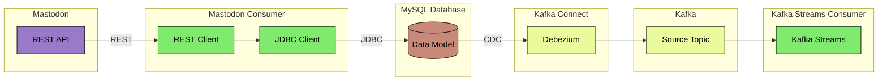

# CDC Event Streaming

This example implements a Change Data Capture (CDC) pipeline with Apache Kafka.

CDC is often used to publish records of data changes in a database.

## Architecture



The arrows in the diagram above signify the direction of data flow.

### Mastodon
The Mastodon social media site has a REST API which authenticated users can use to fetch data. It has both synchronous
and asynchronous endpoint. [Mastodon API docs](https://docs.joinmastodon.org/client/intro)

This is used as the source of data that is written to the database.
E.g. using the search endpoint [mastodon.social/api/v2/search](https://mastodon.social/api/v2/search)

### MySQL Database
The database is the data source of the CDC pipeline. Records written to the database will be captured by the Kafka
Connect Source Connector and published to Kafka. There will be one Kafka topic per database table.

#### Run
The MySQL database is run as a Docker container.

```bash
cd ../docker/mysql
docker-compose up -d
```

#### Config
In order to allow CDC in MySQL it is necessary to enable binary logging of transaction updates. This is done by using
the following CLI parameters:
```bash
--lower_case_table_names=1 --log-bin=bin.log --log-bin-index=bin.log.index --binlog_do_db=sandbox
```

| Parameter              | Description                                                   |
|------------------------|---------------------------------------------------------------|
| lower_case_table_names | Forcing lower case table names so topics also have lower case |
| log-bin                | Name of binary log file                                       |
| log-bin-index          | Name of binary log index file                                 |
| binlog_do_db           | Name of the databases which should enable binary logging      |

### Mastodon Consumer
This Spring Boot application is for ingesting Mastodon posts into the database.

#### Run
```bash
../gradlew :spring-boot-cdc-event-streaming:mastodon-consumer:bootRun
```

The application will fetch posts from the Mastodon REST API and write them to the database together with a record with
the author of each post.

### Apache Kafka
The Kafka broker is run as a Docker container.

#### Run
```bash
cd ../docker/apache-kafka
docker-compose up -d
```

### Apache Kafka Connect
The Kafka Connect instance is run as a Docker container.

#### Run
```bash
cd ../docker/apache-kafka-connect
docker-compose up -d
```

#### Config

### Kafka Streams

#### Run
```bash
../gradlew :spring-boot-cdc-event-streaming:kafka-streams:bootRun
```
