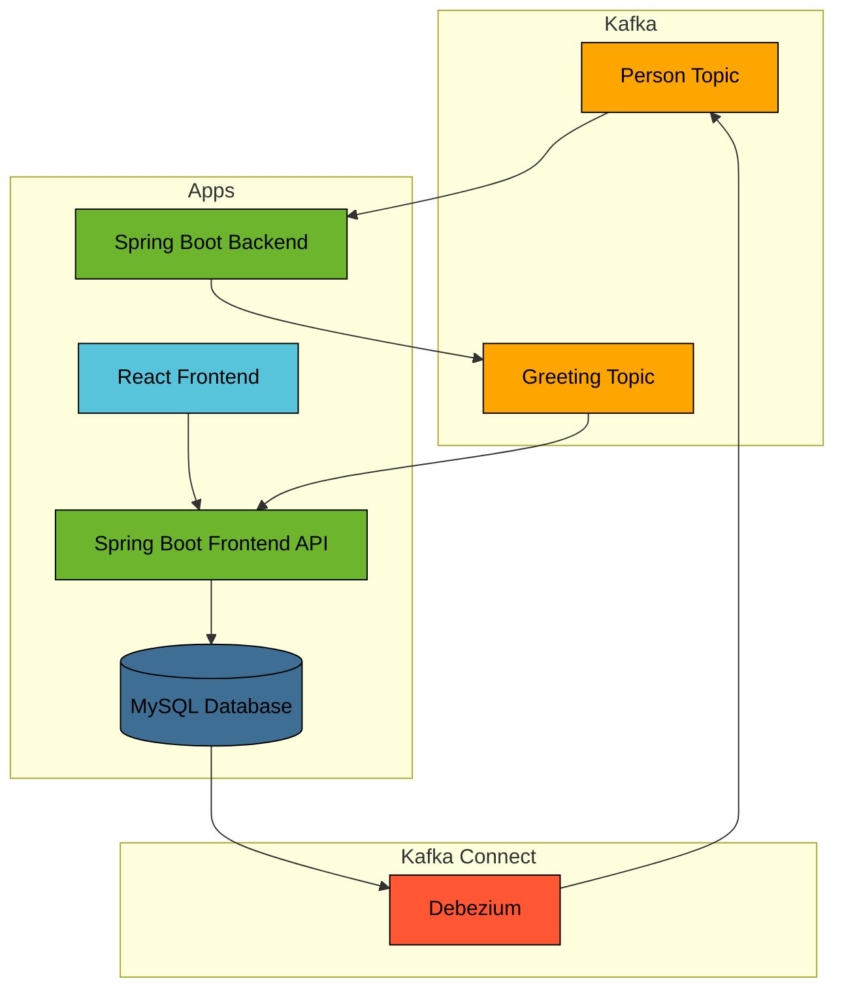

# Spring Boot Kafka CDC

This example implements Change Data Capture (CDC) with Apache Kafka.

CDC is used to publish records of data changes in a database.

## Prerequisites

* Java Runtime - e.g. [Temurin JDK](https://adoptium.net), [OpenJDK](https://openjdk.org) or [Oracle JDK](https://www.oracle.com/java)
* [NodeJS Runtime](https://nodejs.org)
* [NPM](https://www.npmjs.com) or [Yarn](https://yarnpkg.com)
* [Docker](https://www.docker.com)

## Run

Start MySQL Docker container:
```bash
docker compose -f ../docker/mysql/docker-compose.yml up -d
```

Start Kafka Docker container:
```bash
docker compose -f ../docker/kafka/docker-compose.yml up -d
```

Start Kafka Connect Docker container:
```bash
docker compose -f ../docker/kafka-connect/docker-compose.yml up -d
```

Enable Debezium Kafka Connector using Kafka Connect REST API:
```bash
curl -X POST "http://localhost:8083/connectors" -H "Content-Type: application/json" -d @../docker/kafka-connect/resources/mysql-source-connector-config.json
```

Start Backend application:
```bash
../gradlew :spring-boot-kafka-cdc:backend:bootRun
```

Start Frontend API application:

```bash
../gradlew :spring-boot-kafka-cdc:frontend-api:bootRun
```

Start Frontend application (this should open a browser window):
```bash
yarn --cwd ./frontend install
yarn --cwd ./frontend start
```

## Architecture


