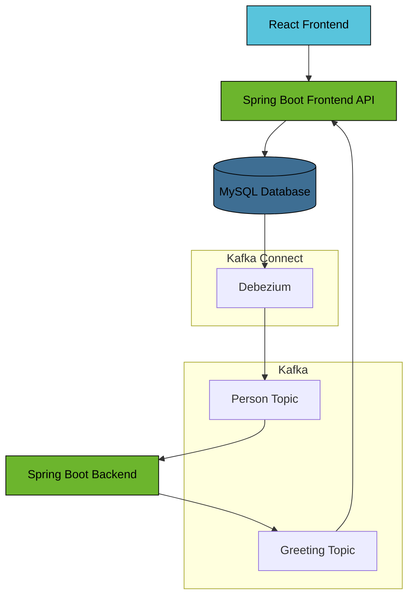

# Spring Boot Kafka CDC

This example implements Change Data Capture (CDC) with Apache Kafka.

CDC is used to publish records of data changes in a database.

## Architecture

```mermaid
graph TD
    A[React Frontend]:::react
    B[Spring Boot Frontend API]:::spring
    C[Spring Boot Backend]:::spring
    D[(MySQL Database)]:::mysql
    subgraph Kafka
        E[Person Topic]
        F[Greeting Topic]
    end
    subgraph Kafka Connect
        G[Debezium]
    end
    
    A --> B
    B --> D
    E --> C
    C --> F
    F --> B
    D --> G
    G --> E
    
    classDef react fill: #58c4dc, stroke: #000000, color: #000000
    classDef spring fill: #6cb52d, stroke: #000000, color: #000000
    classDef mysql fill: #3E6E93, stroke: #000000, color: #000000
```
