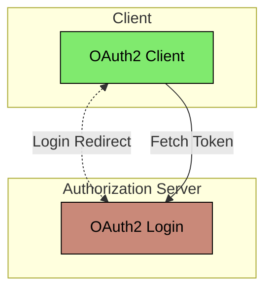

# Spring Boot OAuth2 Authorization Server Extended

This example shows how to extend the Spring Security Authorization Server with production ready features.

## Architecture



### Authorization Server
The Authorization Server is an OAuth2 Authorization Server application based on Spring Boot and the
[spring-security-oauth2-authorization-server](https://spring.io/projects/spring-authorization-server) project.

```bash
cd ./authorization-server
mvn spring-boot:run
```

Look at the `WebSecurityConfig` and the `AuthorizationServerConfig` class, as well as the `application.yml` files for
more details on the security configuration.

### Client
This is a Thymeleaf webapp based on Spring Boot and with an OAuth2 Client security configuration. This application
is only used to invoke a OAuth2 login flow together with the OAuth2 Authorization Server.

```bash
cd ./client
mvn spring-boot:run
```
