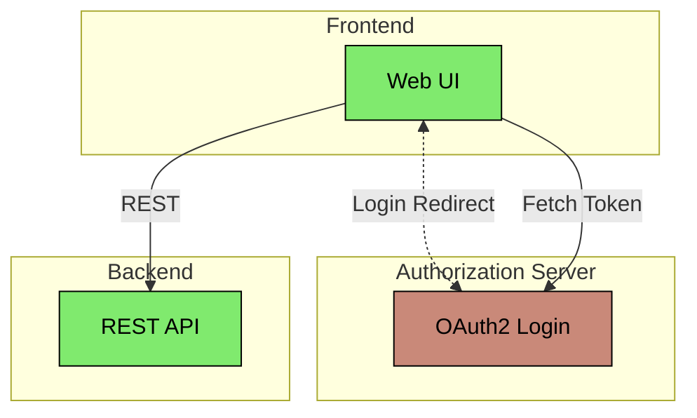

# Spring Boot OAuth2 Extended Authorization Server

This example shows how to extend the Spring Security Authorization Server with production ready features.

By default, Spring Security stores state in-memory. This examples adds persistent state stores. It will also
harden the security setup.

Extended features:
* Storing OAuth2 registered clients in the database.
* Storing OAuth2 authorizations in the database.
* Storing OAuth2 consents in the database.
* Storing user details in the database.
* Using external RSA keys for OAuth2 token signing.
* Requiring PKCE for OAuth2 clients using the Authorization Code Grant flow.

## Architecture



### Authorization Server
The Authorization Server is an OAuth2 Authorization Server application based on Spring Boot and the
[spring-security-oauth2-authorization-server](https://spring.io/projects/spring-authorization-server) project.

```bash
../gradlew :spring-boot-oauth2-authorization-server-extended:authorization-server:bootRun
```

Look at the `WebSecurityConfig` and the `AuthorizationServerConfig` class, as well as the `application.yml` files for
more details on the security configuration.

### Frontend
This is a Thymeleaf webapp based on Spring Boot and with an OAuth2 Client security configuration. This application
is only used to invoke a OAuth2 login flow together with the OAuth2 Authorization Server.

```bash
../gradlew :spring-boot-oauth2-authorization-server-extended:frontend:bootRun
```

### Backend
This is a Spring Boot app with a REST API, which is protected as an OAuth2 Resource Server.

```bash
../gradlew :spring-boot-oauth2-authorization-server-extended:backend:bootRun
```
