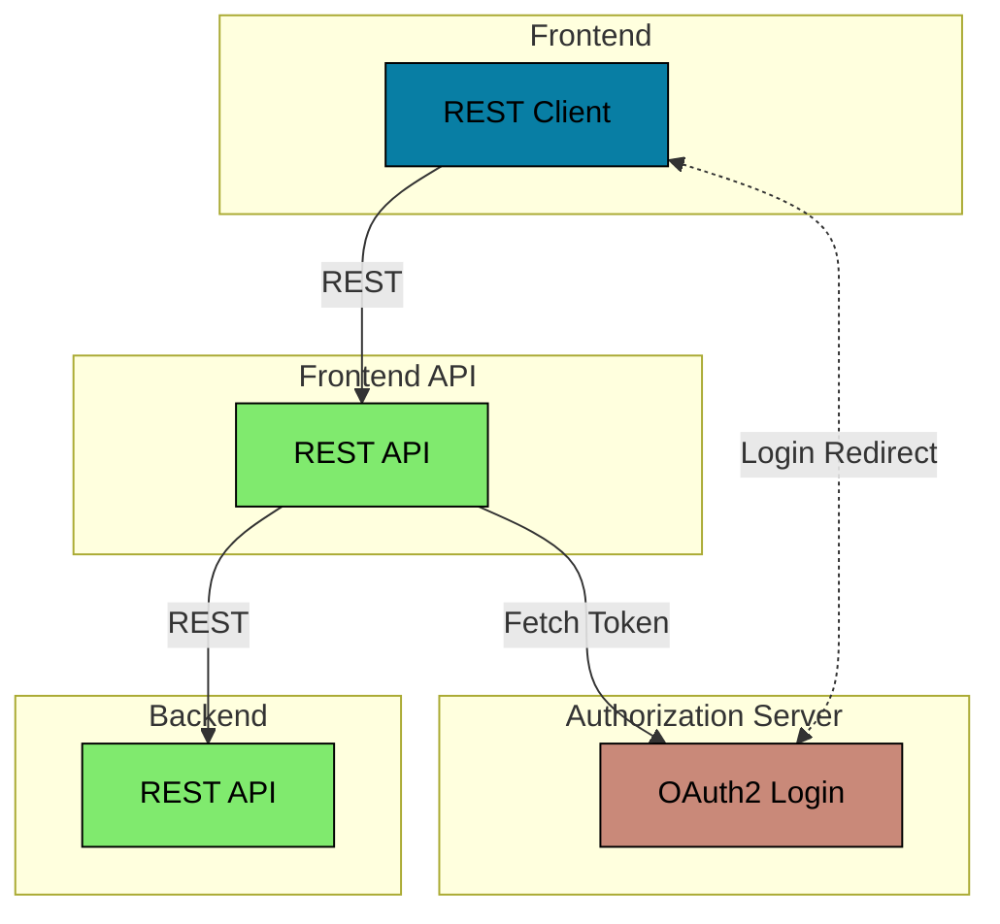

# Spring Boot OAuth2 Token Relay

This example shows how to secure a React frontend and Spring Boot REST API using OAuth2 Token Relay.

It uses the OAuth2 Authorization Code
Grant ([RFC6749 section 4.1](https://datatracker.ietf.org/doc/html/rfc6749#section-4.1))
login flow to authenticate the end users.

## Architecture



### Authorization Server

The Authorization Server is an OAuth2 Authorization Server application based on Spring Boot and the
[spring-security-oauth2-authorization-server](https://spring.io/projects/spring-authorization-server) project.

```bash
../gradlew :spring-boot-oauth2-token-relay:authorization-server:bootRun
```

This Spring Boot application is configured using the simplest setup with only in-memory storage. This is for simplicity
reasons as the main focus of this example is to show how to implement the Frontend and Frontend API applications.

Look at the `application.yml` files for more details on the security configuration.

### Backend

The Backend is a REST API application based on Spring Boot and with an OAuth2 Resource Server security configuration.

```bash
../gradlew :spring-boot-oauth2-token-relay:backend:bootRun
```

This Spring Boot application is protected by Spring Security using the OAuth2 Authorization Code Grant login flow.

Look at the `WebSecurityConfig` class and the `application.yml` files for more details on the security configuration.

### Frontend API

The Frontend API is a REST API application based on Spring Boot and with an OAuth2 Client security configuration.

```bash
../gradlew :spring-boot-oauth2-token-relay:frontend-api:bootRun
```

This Spring Boot application is protected by Spring Security using the OAuth2 Authorization Code Grant login flow.

Look at the `WebSecurityConfig` class and the `application.yml` files for more details on the security configuration.

### Frontend

The Frontend is a JavaScript web application based on ReactJS and using the React Bootstrap framework.

```bash
cd ./frontend
yarn install
yarn start
```

When the React application is loaded into the browser it will call the REST API to fetch data on the currently
logged-in user. If there is an active user session then the API will return the data. If there is no user session then
the API will return an _401 Unauthorized_ HTTP status, as well at a redirect URL in the _Location_ HTTP header. The app
will redirect the browser to the URL to initiate the OAuth2 login flow.
